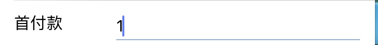

## 组件说明

#### Box
* 标题内容单行左右展示

* 标题输入框但行展示

#### Button
* 按钮组件

#### Calender
* 滑动万年历组件

#### Card
* 筛选部分用的按钮

#### Cart
* 可拖动的小圆球

#### Developing
* 开发中...

#### Header
* app头部导航

#### ItemCheckbox
* 选框

#### Loading
* 加载组件

#### Modal
* Modal组件可以用来覆盖包含React Native根视图的原生视图

#### SerachTitle
* 搜索框

#### Segmented
* Tab选项卡

#### Tip
* 弱提示语

#### Textarea
* Actions.textarea()跳转到备注页面
